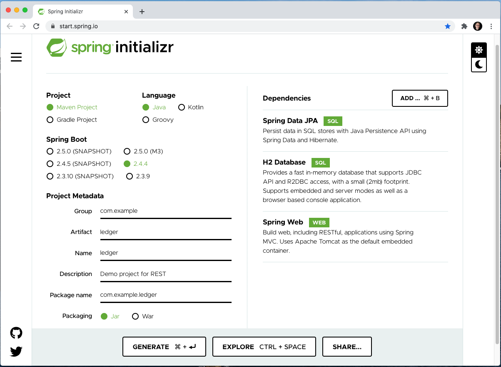
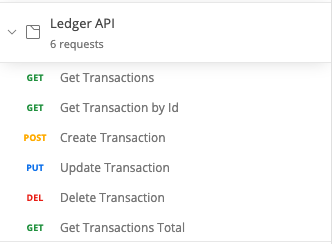
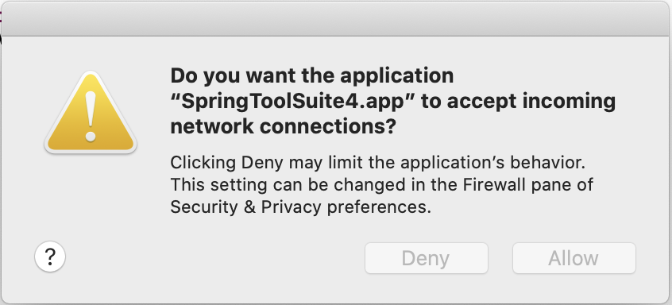
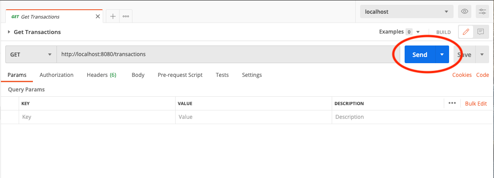

# 5.4 Lesson Plan: REST with CRUD

## Slides
Slide deck for lesson: None

## Overview

HTTP is not just for web pages! It's increasingly common for applications to use REST APIs over HTTP to access and work with data.

In today's lesson we will learn hands-on to use REST with CRUD by building a Ledger API together.

## Learning Objectives

At the end of this section learners should be able to:

- Explain how HTTP methods relate to CRUD
- Build a REST API from a Spring Initializr template
- Create routes to handle common requests
    - GET
    - POST
    - PUT
    - DELETE

## Instructor Notes

The focus for today's lesson is on using REST with CRUD.
- To keep things simple we'll
    - use an in-memory database, H2
    - load it with sample data for the activities in this lesson

Be familiar with using Postman to test a REST API
- sample Postman collections are included with each activity

Each activity in the lesson builds on the work from the previous activity
- the `solved` project from an activity is included as the `starter` project for the next activity
    - to allow you to see the code changes for each activity

- you're encouraged to use the `starter` project from the first activity and keep enhancing it throughout the lesson

---

## Instructor Do: Review REST & CRUD (15 minutes)

We'll start with a review of important concepts about REST APIs

Ask students: What is the purpose of an API?

Answer: An API allows applications to talk to each other

Ask students: What does an API tell us?

Answer:

An API is an interface so it tells us:
- the methods that are available
- how to call those methods
- what data the methods expect to receive
- what data the methods return

### REST

Ask students: What is a resource?

Answer:

A `resource` is any information that can be named

Examples of resources:
- Customer
- Transaction
- Account

Ask students: What is the goal of REST?

Answer:

REST is about providing a uniform way to:
- access resources
- change their state

Ask students: What does it mean when we say that REST is stateless by design?

Answer:

Stateless means that each request is handled in isolation from all other requests

Servers do not
- remember any previous requests
- anticipate any future requests

### CRUD

Ask students: What does CRUD stand for?

Answer: Create, Read, Update, Delete

It's not specified in REST but HTTP methods are commonly used to determine what the client wants to do with a resource:

| CRUD    | HTTP Method |
| ------- | ----------- |
| Create  | POST        |
| Read    | GET         |
| Update  | PUT         |
| Delete  | DELETE      |

## We Do: Intro (45 minutes)

In this activity we'll start building a Ledger API using a template generated by `Spring Initialzr`

[starter](./activities/01-intro/starter/)

[solved](./activities/01-intro/solved/)

Tell learners to follow the steps along with you

Open [Spring Initialzr](https://start.spring.io/)
- For `Project`
    - select a `Maven Project`
- For `Spring Boot`
    - select `2.4.4`
- For `Project Metadata`:
    - enter `ledger` for `Artifact`
    - enter `ledger` for `Name`
- For `Dependencies` add the following dependencies:
    - Spring Data JPA
    - H2 Database
    - Spring Web



Click the `Generate` button to download the project files as a `.zip`

Unzip the project file and import it into your workspace

The template provides
- all of the required dependencies we need
- an application class

```java
package com.example.ledger;

import org.springframework.boot.SpringApplication;
import org.springframework.boot.autoconfigure.SpringBootApplication;

@SpringBootApplication
public class LedgerApplication {

	public static void main(String[] args) {
		SpringApplication.run(LedgerApplication.class, args);
	}

}
```

We'll code the rest together

### Ledger API

The Ledger API will support the following routes:

| URL                   | HTTP Method | Description           |
| --------------------- | ----------- | -------------- |
| /api/transactions     | GET         | Gets all transactions |
| /api/transactions/:id | GET         | Gets a specific transaction  |
| /api/transactions/    | POST        | Creates a new transaction  |
| /api/transactions/    | PUT         | Updates a transaction  |
| /api/transactions/:id | DELETE      | Deletes a transaction  |
| /api/transactions/sum | GET         | Gets the sum of all transactions  |

Key points:
- works with `Transaction` resources
- allows us to access resources in a uniform way
    - `/api/transactions`
- allows us to change the state of a transaction resource
    - Create
    - Update
    - Delete

### Postman

Import the [Ledger API collection](./activities/01-intro/starter/ledgerApi.postman.json) into Postman



Explain that in this activity we'll be:
- using Postman as a `client`
- creating an application to be a `server`

Ask students: What does a server do?

Answer:

A server
- listens for a request from a client
- handles the request
- sends a response to the client

### Controller

Add a `controller` folder under `com.example.ledger`
- to keep things organized

Create a `TransactionController` class in the `controller` folder with the following code:

```java
package com.example.ledger.controller;

import org.springframework.web.bind.annotation.RestController;
import org.springframework.web.bind.annotation.GetMapping;

@RestController
public class TransactionController {

	  @GetMapping("/transactions")
	  String all() {
	    return "Response from controller.";
	  }
}
```

The `@RestController` annotation does two things:
- indicates that the `TransactionController` class is a controller
    - the same as adding the `@Controller` annotation
- indicates that the controller methods will return responses
    - the same as adding the `@ResponseBody` annotation to each method in the controller

The `@GetMapping` annotation indicates the `all` method will handle requests:
- for the `Get` method
- for the `/transactions` route

For demonstration we are returning a String reponse:
```java
return "Response from controller.";
```

Run the project
- the server needs to listen for requests so you may need to `allow` network connections to the server

    

Select the `GetTransactions` request from the `Ledger API` collection in Postman and click `Send`


Explain that:
- the client is making a `GET` request to the URL that is displayed in the address bar
    - for example, `https://localhost:8080/transactions`
- the server is:
    - listens for requests
    - sends a response

Answer any questions before moving to the next step

### Transaction

Highlight that with a few lines of code we have a server running and handling requests!
- but we're not doing anything with transactions yet

Add a `dao` folder under `com.example.ledger`
- for our data access

**Instructor Note:** Point out to students that the `Transaction` class is included in the [starter](./activities/01-intro/starter/)
 folder

Create a `Transaction` class in the `dao` folder with the following code:

```java
package com.example.ledger.dao;

import java.math.*;
import java.util.Objects;

import javax.persistence.Entity;
import javax.persistence.GeneratedValue;
import javax.persistence.Id;
import javax.persistence.Column;

@Entity
public class Transaction {

  private @Id @GeneratedValue Long id;
  private String sender;
  private String recipient;

  @Column(name = "soft_delete")
  private boolean softDelete;

  @Column(name = "transaction_value")
  private BigDecimal transactionValue;

  Transaction() {}

  Transaction(String sender, String recipient, BigDecimal transactionValue) {
    this.sender = sender;
    this.recipient = recipient;
    this.transactionValue = transactionValue;
  }

  public Long getId() {
    return this.id;
  }

  public String getSender() {
    return this.sender;
  }

  public String getRecipient() {
    return this.recipient;
  }

  public boolean getSoftDelete() {
    return this.softDelete;
  }

  public BigDecimal getTransactionValue() {
    return this.transactionValue;
  }

  public void setId(Long id) {
    this.id = id;
  }

  public void setSender(String sender) {
    this.sender = sender;
  }

  public void setRecipient(String recipient) {
    this.recipient = recipient;
  }

  public void setSoftDelete(boolean softDelete) {
    this.softDelete = softDelete;
  }

  public void setTransactionValue(BigDecimal transactionValue) {
    this.transactionValue = transactionValue;
  }

  @Override
  public boolean equals(Object o) {

    if (this == o)
    return true;
    if (!(o instanceof Transaction))
    return false;

    Transaction transaction = (Transaction) o;
    return Objects.equals(this.id, transaction.id)
      && Objects.equals(this.sender, transaction.sender)
      && Objects.equals(this.recipient, transaction.recipient)
      && Objects.equals(this.softDelete, transaction.softDelete)
      && Objects.equals(this.transactionValue, transaction.transactionValue);
  }

  @Override
  public int hashCode() {
    return Objects.hash(this.id, this.sender, this.recipient, this.softDelete, this.transactionValue);
  }

  @Override
  public String toString() {
    return "Transaction{" + "id=" + this.id + ", sender='" + this.sender + '\'' + ", recipient='" + this.recipient + '\'' + ", softDelete='" + this.softDelete + '\'' + ", transactionValue='" + this.transactionValue + '\'' + '}';
  }
}
```

A transaction needs:
- an id
- a sender
- a recipient
- an amount

Key points:
- by default properties are mapped to database columns by name
    - the `@Column` annotation lets us map a property to a database column that has a different name
        - for example, we can map the `transaction_value` database column to the `transactionValue` property
            >this is important for consistency and because JPA expects we are following the standard camel casing for property names
- the `softDelete` property allows us to mark a transaction as deleted
    - without actually deleting it from the database
    - we'll implement the common CRUD operations first and then refactor to support this in a later activity

```java
  private @Id @GeneratedValue Long id;
  private String sender;
  private String recipient;

  @Column(name = "soft_delete")
  private boolean softDelete;

  @Column(name = "transaction_value")
  private BigDecimal transactionValue;
```

### Repository

Create a `TransactionRepository` interface in the `dao` folder with the following code:

```java
package com.example.ledger.dao;

import org.springframework.data.jpa.repository.JpaRepository;

public interface TransactionRepository extends JpaRepository<Transaction, Long> {
}
```

Highlight that inheriting from the `JpaRepository` means that the common CRUD operations are implemented for us

### Sample Data

We'll include some sample data to use for testing

**Instructor Note:** Point out to students that the `LoadDatabase` class is included in the [starter](./activities/01-intro/starter/)
 folder

Create a `LoadDatabase` class in the `com.example.ledger` folder with the following code:

```java
package com.example.ledger;

import java.math.*;

import org.slf4j.Logger;
import org.slf4j.LoggerFactory;
import org.springframework.boot.CommandLineRunner;
import org.springframework.context.annotation.Bean;
import org.springframework.context.annotation.Configuration;

import com.example.ledger.dao.Transaction;
import com.example.ledger.dao.TransactionRepository;

@Configuration
class LoadDatabase {

  private static final Logger log = LoggerFactory.getLogger(LoadDatabase.class);

  @Bean
  CommandLineRunner initDatabase(TransactionRepository repository) {

    return args -> {
      log.info("Seeding transaction data.");
      log.info("data =>" + repository.save(new Transaction("Iron Man", "Captain America", new BigDecimal("50000.25"))));
      log.info("data =>" + repository.save(new Transaction("Captain America", "Iron Man", new BigDecimal("500.25"))));
      log.info("data =>" + repository.save(new Transaction("Captain America", "Hulk", new BigDecimal("50.25"))));
    };
  }
}
```

Key points:
- when the server starts this will load sample data for us to work with
- we could have easily used a variety of databases for the lesson
    - we chose H2 so we could focus on working with our API and not spend time on database setup
        - H2 an in-memory open source database

### Get All Transactions

We'll use the `TransactionRepository` to provide data to the controller

Modify `TransactionController` to look like the following:

```java
package com.example.ledger.controller;

import org.springframework.web.bind.annotation.RestController;
import org.springframework.web.bind.annotation.GetMapping;

import java.util.List;

import com.example.ledger.dao.Transaction;
import com.example.ledger.dao.TransactionRepository;

@RestController
public class TransactionController {

	private final TransactionRepository repository;

	  TransactionController(TransactionRepository repository) {
		    this.repository = repository;
		  }
	
	  @GetMapping("/transactions")
	  List<Transaction> all() {
	    return repository.findAll();
	  }
}
```

Key points:
- the `TransactionRepository` is being injected into the constructor
- the `all` method will
    - call the repository to find all transactions
    - return the list of transactions
    - the list will be mapped to a JSON response

Test the `Get Transactions` method from Postman and show the response:

```
[
    {
        "id": 1,
        "sender": "Iron Man",
        "recipient": "Captain America",
        "softDelete": false,
        "transactionValue": 50000.25
    },
    {
        "id": 2,
        "sender": "Captain America",
        "recipient": "Iron Man",
        "softDelete": false,
        "transactionValue": 500.25
    },
    {
        "id": 3,
        "sender": "Captain America",
        "recipient": "Hulk",
        "softDelete": false,
        "transactionValue": 50.25
    }
]
```

Answer any questions before moving to the next activity

---

## BREAK (15 min)

---

## We Do: CRUD (60 minutes)

In this activity we'll continue building the CRUD operations for the Ledger API

[starter](./activities/02-crud/starter/)

[solved](./activities/02-crud/solved/)

Tell the learners to code along with you

### Get a Transaction by Id

We can return all of the transactions. Now we'll support returning a specific transaction by id

| URL                   | HTTP Method | Description           |
| --------------------- | ----------- | -------------- |
| /api/transactions     | GET         | Gets all transactions |
| /api/transactions/:id | GET         | Gets a specific transaction  |

Open the `TransactionController`
- add the following import:

    ```java
    import org.springframework.web.bind.annotation.PathVariable;
    ```

- Add the `one` method containing the following code:

    ```java
    // get a specific transaction by id

    @GetMapping("/transactions/{id}")
    Transaction one(@PathVariable Long id) {
    return repository.findById(id)
            .orElseThrow(() -> new TransactionNotFoundException(id));
    }
    ```

Key points:
- the `@PathVariable` annotation allows us to get the id from the route
- we return the transaction from the repository
- or throw an exception if we can't find the transaction

Create a `TransactionNotFoundException` class in the `controller` folder with the following code:

```java
package com.example.ledger.controller;

public class TransactionNotFoundException extends RuntimeException {
	private static final long serialVersionUID = 2561734181276856423L;

	TransactionNotFoundException(Long id) {
		super("Could not find transaction " + id);
	}
}
```

Test the `Get Transaction by Id` method from Postman and show the response:

```
{
    "id": 3,
    "sender": "Captain America",
    "recipient": "Hulk",
    "softDelete": false,
    "transactionValue": 50.25
}
```

This route is finding the transaction with an id of 3:

```
http://localhost:8080/transactions/3
```

Try changing the id to a value that doesn't exist:

```
http://localhost:8080/transactions/4
```

We're throwing an exception when the transaction isn't found so the response has a `500` status code:

```
{
    "timestamp": "2021-03-21T21:56:05.834+00:00",
    "status": 500,
    "error": "Internal Server Error",
    "message": "",
    "path": "/transactions/4"
}
```

It would be better to return a `404` status code for `Not Found`

Create a `TransactionNotFoundAdvice` class in the `controller` folder with the following code:

```java
package com.example.ledger.controller;

import org.springframework.http.HttpStatus;
import org.springframework.web.bind.annotation.ControllerAdvice;
import org.springframework.web.bind.annotation.ExceptionHandler;
import org.springframework.web.bind.annotation.ResponseBody;
import org.springframework.web.bind.annotation.ResponseStatus;

  // this wraps the TransactionNotFoundException and returns an HTTP response

  @ControllerAdvice
  class TransactionNotFoundAdvice {

    @ResponseBody
    @ExceptionHandler(TransactionNotFoundException.class)
    @ResponseStatus(HttpStatus.NOT_FOUND)
    String transactionNotFoundHandler(TransactionNotFoundException ex) {
      return ex.getMessage();
    }
}
```

Key points:
- the `TransactionNotFoundAdvice` class handles exceptions of type `TransactionNotFoundException`
- the `transactionNotFoundHandler` method will return
    - a `Not Found` status code
    - an HTTP response containing the message from the exception

Using Postman to test for a transaction id that doesn't exist:

```
http://localhost:8080/transactions/4
```

Provides a `404` status code and a response:
```
Could not find transaction 4
```

Answer any questions before moving to the next step

### Create a Transaction

Now we'll add a method to create a transaction:

| URL                   | HTTP Method | Description           |
| --------------------- | ----------- | -------------- |
| /api/transactions/    | POST        | Creates a new transaction  |

Open the `TransactionController`
- add the following imports:

    ```java
    import org.springframework.web.bind.annotation.PostMapping;
    import org.springframework.web.bind.annotation.RequestBody;
    ```

- Add the `newTransaction` method containing the following code:

    ```java
	  // create a new transaction

	  @PostMapping("/transactions")
	  Transaction newTransaction(@RequestBody Transaction newTransaction) {
	    return repository.save(newTransaction);
	  }
    ```

Key points:
- the `@PostMapping` handles `POST` requests
    - we'll map `POST` requests to `Create` new transactions
- the `@RequestBody` annotation means the data for `newTransaction` comes from the body of the request

>It's common practice to return the newly created transaction in the response

Test the `Create Transaction` method from Postman

- Show that the request body contains the data:

    ```
    {
        "sender": "Thor",
        "recipient": "Spiderman",
        "transactionValue": 250.00
    }
    ```

- Point out that the response includes the id that was created:

    ```
    {
        "id": 4,
        "sender": "Thor",
        "recipient": "Spiderman",
        "softDelete": false,
        "transactionValue": 250.00
    }
    ```

### Update a Transaction

Add a method to update a transaction:

| URL                   | HTTP Method | Description           |
| --------------------- | ----------- | -------------- |
| /api/transactions/    | PUT         | Updates a transaction  |

Open the `TransactionController`
- add the following import:

    ```java
    import org.springframework.web.bind.annotation.PutMapping;
    ```

- Add the `updateTransaction` method containing the following code:

    ```java
	  // update a transaction

	  @PutMapping("/transactions/{id}")
	  Transaction updateTransaction(@RequestBody Transaction newTransaction, @PathVariable Long id) {

	    return repository.findById(id)
	      .map(transaction -> {
	        transaction.setSender(newTransaction.getSender());
	        transaction.setRecipient(newTransaction.getRecipient());
	        transaction.setTransactionValue(newTransaction.getTransactionValue());
	        return repository.save(newTransaction);
	      })
  		.orElseThrow(() -> new TransactionNotFoundException(id));
	  }
    ```

Key points:
- the route contains the id
- the request body contains the data
- find the existing transaction
- map values from the request body to the existing transaction
- save the changes

Test the `Update Transaction` method from Postman

- Show that the route contains the id:

    ```
    http://localhost:8080/transactions/4
    ```

- Show that the request body contains the data:

    ```
    {
        "sender": "Thor",
        "recipient": "Hulk",
        "transactionValue": 100.50
    }
    ```

- Show that the response contains the updated transaction:

    ```
    {
        "id": 4,
        "sender": "Thor",
        "recipient": "Hulk",
        "softDelete": false,
        "transactionValue": 100.50
    }
    ```

### Delete a Transaction

Add a method to delete a transaction:

| URL                   | HTTP Method | Description           |
| --------------------- | ----------- | -------------- |
| /api/transactions/:id | DELETE      | Deletes a transaction  |

Open the `TransactionController`
- add the following import:

    ```java
    import org.springframework.web.bind.annotation.DeleteMapping;
    ```

- Add the `deleteTransaction` method containing the following code:

    ```java
    // delete a transaction

    @DeleteMapping("/transactions/{id}")
    void deleteTransaction(@PathVariable Long id) {
        if (repository.existsById(id)) {
            repository.deleteById(id);
        }
    }
    ```

Key points:
- the route contains the id
- the request body is empty
- find the existing transaction
- delete the transaction

Test the `Delete Transaction` method from Postman
- verify the delete is successful using the `Get All Transactions` method from Postman

### Get Transactions Total

Add a method to sum the values of all transactions:

| URL                   | HTTP Method | Description           |
| --------------------- | ----------- | -------------- |
| /api/transactions/sum | GET         | Gets the sum of all transactions  |

Open the `TransactionRepository`
- add the following imports:

    ```java
    import java.math.BigDecimal;
    import org.springframework.data.jpa.repository.Query;
    ```

- Add the `getSumTransactionValue` method to the interface:

    ```java
	@Query("SELECT SUM(t.transactionValue) from Transaction t")
	BigDecimal getSumTransactionValue();
    ```

Key points:
- the `@Query` annotation allows us to specify the query to use

Open the `TransactionController`
- add the following import:

    ```java
    import java.math.BigDecimal;
    ```

- Add the `sum` method containing the following code:

    ```java
    // get the sum of all transactions

    @GetMapping("/transactions/sum")
    BigDecimal sum() {
    return repository.getSumTransactionValue();
    }
    ```

Key points:
- returns the sum of all of the transactions

Test the `Get Transactions Total` method from Postman and show the response:

```
50550.75
```

Answer any questions before moving to the next activity

---

## BREAK (15 min)

---

## We Do: Soft Delete (60 minutes)

In this activity we'll refactor the Ledger API to support a "soft delete"
- a "soft delete" means that when we delete
    - we will mark a transaction as deleted
    - without actually deleting it from the database

[starter](./activities/03-soft-delete/starter/)

[solved](./activities/03-soft-delete/solved/)

The Ledger API supports the following routes:

| URL                   | HTTP Method | Description           |
| --------------------- | ----------- | -------------- |
| /api/transactions     | GET         | Gets all transactions |
| /api/transactions/:id | GET         | Gets a specific transaction  |
| /api/transactions/    | POST        | Creates a new transaction  |
| /api/transactions/    | PUT         | Updates a transaction  |
| /api/transactions/:id | DELETE      | Deletes a transaction  |
| /api/transactions/sum | GET         | Gets the sum of all transactions  |

### TransactionRepository

The first step in refactoring is to treat transactions where the `softDelete` property equals `true` as if they don't exist

Open the `TransactionRepository`
- add the following import:

    ```java
    import java.util.Optional;
    ```

- Add the `findByIdAndSoftDeleteFalse` method to the interface:

    ```java
	Optional<Transaction> findByIdAndSoftDeleteFalse(Long id);
    ```

Key points:
- remind learners that `Optional` represents a result that might be `null`
    - so we always get a result
    - we need to check if the result contains a value
- remind learners that JPA will create the query for us based on the method name
    - the `findByIdAndSoftDeleteFalse` method will use a query similar to `SELECT t FROM Transaction t WHERE t.id = ? AND t.soft_delete = 0`

### Delete a Transaction

Open the `TransactionController`
- add the following import:

    ```java
    import java.util.Optional;
    ```

- Modify the `deleteTransaction` method to look like the following:

    ```java
	  // delete a transaction

	  @DeleteMapping("/transactions/{id}")
	  void deleteTransaction(@PathVariable Long id) {

	    Optional<Transaction> transaction = repository.findByIdAndSoftDeleteFalse(id);
	    transaction.ifPresent(t -> {
	      t.setSoftDelete(true);
	      repository.save(t);
	    });
	  }
    ```

Key points:
- use the `findByIdAndSoftDeleteFalse` method to ignore any soft deleted transactions
- the `ifPresent` method checks if a transaction exists
find the existing transaction
- set the `softDelete` property to `true`
- save the changes

Test the `Delete Transaction` method from Postman
- soft delete an existing transaction
    - for example, http://localhost:8080/transactions/2

Verify the soft delete is successful using the `Get All Transactions` method from Postman

Highlight that `softDelete` is `true` for the transaction with an id of `2`:

```
[
    {
        "id": 1,
        "sender": "Iron Man",
        "recipient": "Captain America",
        "softDelete": false,
        "transactionValue": 50000.25
    },
    {
        "id": 2,
        "sender": "Captain America",
        "recipient": "Iron Man",
        "softDelete": true,
        "transactionValue": 500.25
    },
    {
        "id": 3,
        "sender": "Captain America",
        "recipient": "Hulk",
        "softDelete": false,
        "transactionValue": 50.25
    }
]
```

### Get a Transaction by Id

Open the `TransactionController`

- Modify the `one` method to look like the following:

    ```java
    // get a specific transaction by id

    @GetMapping("/transactions/{id}")
    Transaction one(@PathVariable Long id) {
    return repository.findByIdAndSoftDeleteFalse(id)
            .orElseThrow(() -> new TransactionNotFoundException(id));
    }
    ```

Key points:
- the only change is to use the `findByIdAndSoftDeleteFalse` method

Test the `Get Transaction by Id` method from Postman returns the correct response:
```
{
    "id": 2,
    "sender": "Captain America",
    "recipient": "Iron Man",
    "softDelete": false,
    "transactionValue": 500.25
}
```

Test the `Delete Transaction` method from Postman to delete an existing transaction
    - for example, http://localhost:8080/transactions/2

Test the `Get Transaction by Id` method from Postman for the same id that was deleted
- verify that the soft deleted transaction returns a not found response

Provides a `404` status code and a response:
```
Could not find transaction 4
```

### Get All Transactions

Open the `TransactionRepository`
- add the following import:

    ```java
    import java.util.List;
    ```

- Add the `findByIdAndSoftDeleteFalse` method to the interface:

    ```java
	List<Transaction> findAllBySoftDeleteFalse();
    ```

Open the `TransactionController`
- Modify the `all` method to look like the following:

    ```java
    /*
    * get all transactions
    * 	- does not include transactions that have been soft deleted
    */

    @GetMapping("/transactions")
    List<Transaction> all() {

    return repository.findAllBySoftDeleteFalse();
    }
    ```

Key points:
- the only change is to use the `findAllBySoftDeleteFalse` method

Test the `Delete Transaction` method from Postman
- soft delete an existing transaction
    - for example, http://localhost:8080/transactions/2

Verify the soft delete is successful using the `Get All Transactions` method from Postman:

```
[
    {
        "id": 1,
        "sender": "Iron Man",
        "recipient": "Captain America",
        "softDelete": false,
        "transactionValue": 50000.25
    },
    {
        "id": 3,
        "sender": "Captain America",
        "recipient": "Hulk",
        "softDelete": false,
        "transactionValue": 50.25
    }
]
```

### Update a Transaction

Open the `TransactionController`
- Modify the `updateTransaction` method to look like the following:

    ```java
    // update a transaction

    @PutMapping("/transactions/{id}")
    Transaction updateTransaction(@RequestBody Transaction newTransaction, @PathVariable Long id) {

    return repository.findByIdAndSoftDeleteFalse(id)
        .map(transaction -> {
        transaction.setSender(newTransaction.getSender());
        transaction.setRecipient(newTransaction.getRecipient());
        transaction.setTransactionValue(newTransaction.getTransactionValue());
        return repository.save(newTransaction);
        })
    .orElseThrow(() -> new TransactionNotFoundException(id));
    }
    ```

Key points:
- the only change is to use the `findAllBySoftDeleteFalse` method

Test the `Update Transaction` method from Postman

```
{
    "id": 4,
    "sender": "Thor",
    "recipient": "Hulk",
    "softDelete": false,
    "transactionValue": 100.50
}
```

### Get Transactions Total

Open the `TransactionRepository`
- modify the query for the `getSumTransactionValue` method on the interface:

```java
	@Query("SELECT SUM(t.transactionValue) FROM Transaction t WHERE t.softDelete = 0")
	BigDecimal getSumTransactionValue();
```

Test the `Delete Transaction` method from Postman
- soft delete an existing transaction
    - for example, http://localhost:8080/transactions/2

Verify the soft delete is successful using the `Get Transactions Total` method from Postman:

```
50050.50
```

## Instructor Do: Recap (10 min)

In today's lesson we:

- Explained how HTTP methods relate to CRUD
- Built a REST API from a Spring Initializr template
- Created routes to handle common requests
    - GET
    - POST
    - PUT
    - DELETE

REST APIs over HTTP are a common way for applications to access and work with data. Today we learned how easy it is to create a REST API using Spring.